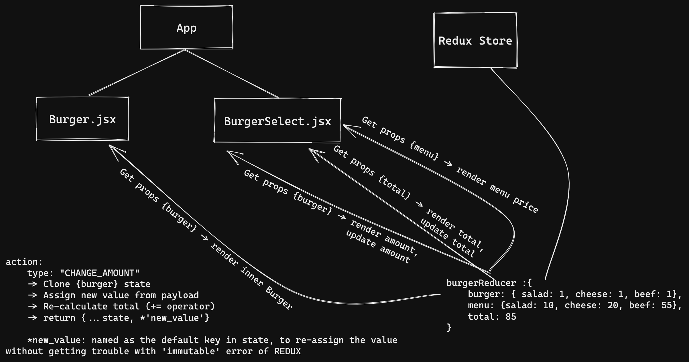

# Burger selecting menu with REDUX

#### By: quangpn7 
##### Date: 01-Dec-2022
---
## Overview:
- This repository contains a simple Burger Menu app which help you to select main inner ingredients: **Salad, Chees, Beef**.
- The main objective of the App is to help getting more practical **`Redux`** using.
- You can use further browser extension called **`Redux devTool`** to have a deep review of the App.
---
## I. Component
**- Using Class Component**
  
**1. Burger**
   - Contains **`Burger`** (made by `CSS`)
   - Rendered by later receiving data from **`Redux`**

**2. BurgerSelect**
   - Contains table which has: ingredients, amount, price, total.
   - Rendered by later receiving data from **`Redux`**
   - Button: 
     - **"+", "-"**:  changing the ammount by users' selects.
     - **"Reset"** (fa5 sync icon): reset all change to default value.
## II. Redux store:
**- Default store:**
```javascript
{
  burgerReducer: { // Main reducer
    burger: {  // Storing ingredient selection, render,...
      salad: 1, // All ingredients are set default at 1
      cheese: 1,
      beef: 1
    },
    menu: { // Store price of ingredients
      salad: 10, // Changable but no need
      cheese: 20,
      beef: 55
    },
    total: 85 // Total for rendering, will be changed at any action
  }
}
```

## III. Connect & Action:
#### Connect
- **Burger.jsx**
  - Get `{burgerReducer.burger}` to render the burger
- **BurgerSelection**.
  - Get `{burgerReducer.burger}` to render the name and amount at table's 1st, 2nd columns.
  - Get `{burgerReducer.menu}` to render the price at table's 3rd column.
  - Get `{burgerReducer.total}` to render the total pay at table's footer.

#### Action
- Type: `"CHANGE_AMOUNT"`
  - Update the amount of specific ingredient in **`{burgerReducer.burger}`**.
  - Update **`{burgerReducer.total}`**.
  - Set `reset button` disabled or not by comparing current **`{burgerReducer.total}`** with `85` *(number type)*.
- Type: `"RESET"`
  - Revert every change to default state.
  


---
# Thank for reading this repository